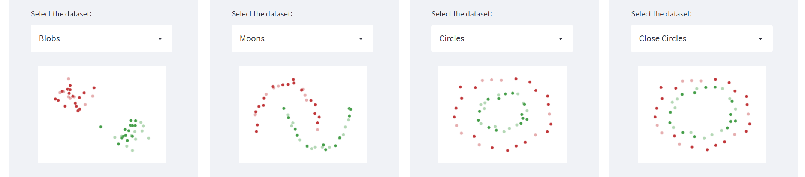
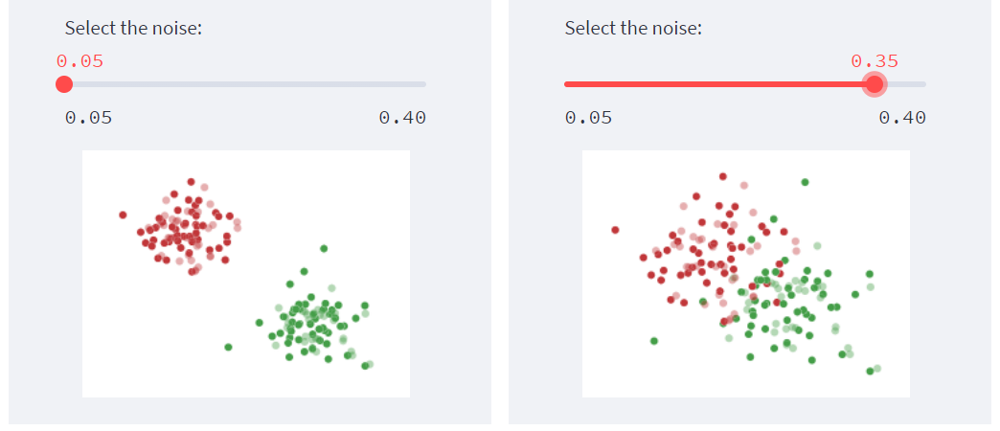
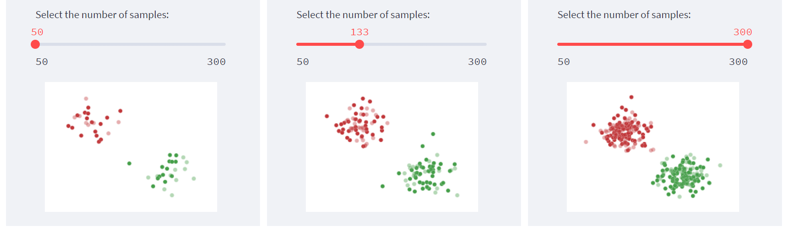
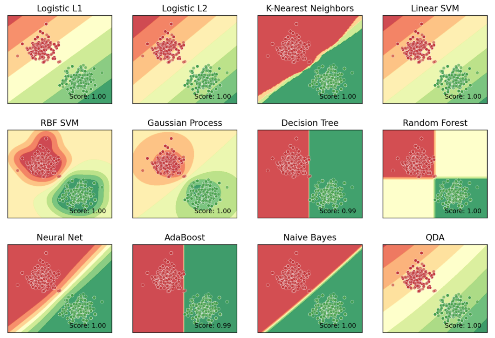
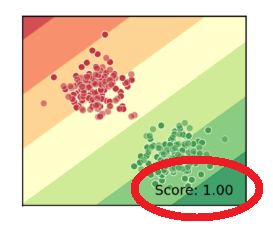

# ⚖️ Scikit-Learn Classifiers Comparison
## 👉 **Check it out [here](https://share.streamlit.io/paulinomoskwa/interactive-classifiers-comparison/main.py)!**

    

## 📖 **About**
This project comes with the goal of comparing different binary classifiers from the python Scikit-learn library. No in-depth knowledge of classifiers or programming is necessary to take advantage of this website. The website relies on two core libraries:

* `streamlit` for putting a webapp into production
* `scikit-learn` for handling classifiers

On the left sidebar it is possible to choose:

* the type of dataset to be considered

    

* the noise to add to the data (which affects how much the two different classes overlap)

    

* the number of data points

    

Once the choices are set, the classifiers will be updated automatically and it will be possible to see which one performed better.

    

In addition, to make the analysis more practical, for each classifier is also printed the accuracy score:

    

